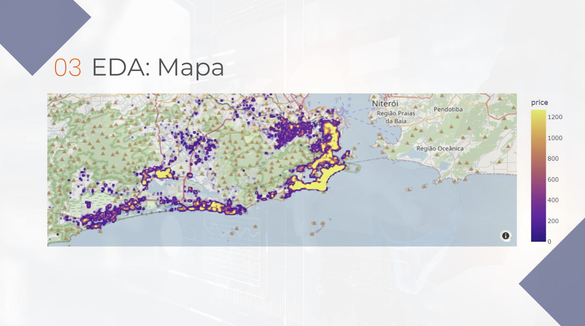
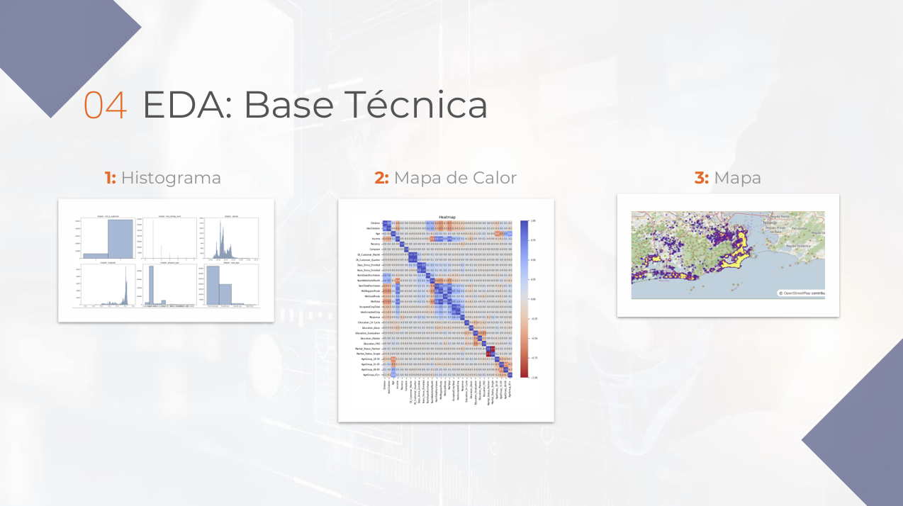
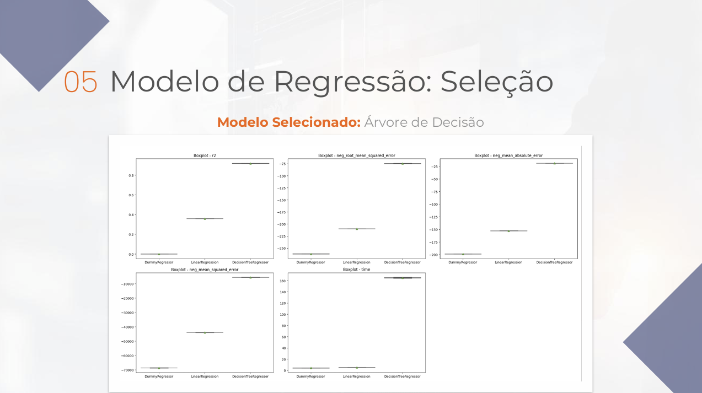
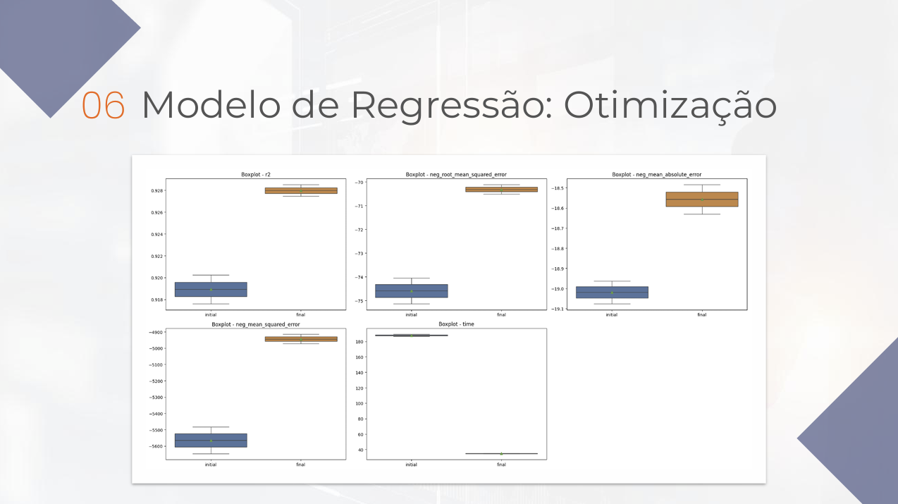

# Ciência de Dados - Projeto Final 4

## Projeto
**Modelo de regressão** para previsão da diária de aluguel de imóveis em um aplicativo de aluguéis.

## Descrição
Nesse projeto de Ciência de Dados, resumidamente, foi realizado um amplo processo de tratamento dos dados devido a ter um dataset com muitos registros e features analisadas. Dessa forma foi possível focar apenas nas informações relevantes para a criação do modelo de regressão. Em seguida, foi criado um modelo de regressão usando Árvore de Regressão para prever o valor ideal a se cobrar em uma diária de aluguel na plataforma de imóveis na cidade do Rio de Janeiro, permitindo assim otimizar o valor a ser cobrando por um imóvel na cidade.

## Referências
- **Link do Kaggle:** https://www.kaggle.com/datasets/allanbruno/airbnb-rio-de-janeiro

## Resultados - Projeto

## Resultados - EDA

## Resultados - Regressão

## Resultados - Overfitting

## Resultados - Deploy

## Resultados - Conclusão
