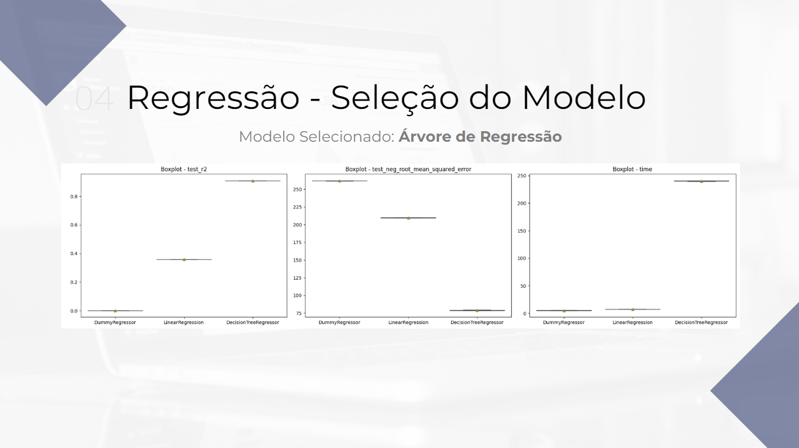
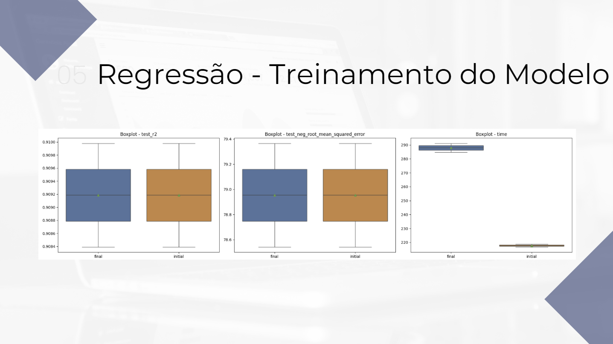

# Ciência de Dados - Projeto Final 4

## Projeto
**Modelo de regressão** para previsão da diária de aluguel de imóveis em um aplicativo de aluguéis.

## Objetivo
O objetivo do projeto é, a partir de dados históricos, construir um **modelo de regressão** para previsão da diária de aluguel em um aplicativo de aluguéis de imóveis.  

A intenção é que o modelo preveja o valor para se cobrar em uma diária de aluguel na plataforma de imóveis, permitindo que a empresa identifique qual é o valor ideal para se cobrar na diária do imóvel, otimizando assim o retorno com o aluguel dos imóveis.

## Descrição
.........................

## Referências
- **Link do Kaggle:** https://www.kaggle.com/datasets/allanbruno/airbnb-rio-de-janeiro

## Bibliotecas
- **Matplotlib:** https://matplotlib.org/
- **NumPy:** https://pandas.pydata.org/docs/index.html
- **Pandas:** https://pandas.pydata.org/docs/index.html
- **Scikit-Learn:** https://seaborn.pydata.org/
- **Seaborn:** https://seaborn.pydata.org/

## Estrutura do Projeto
- **.venv/:** Pasta destinada a armazenar o ambiente virtual do projeto se necessário
- **data/:** Pasta destinada a armazenar as versões dos datasets: raw, processed, lean, transformed, entre outros
- **deploys/:** Pasta destinada a armazenar os deploys do projeto, em formatos jupyter notebook, python, executável e streamlit
- **dictionaries/:** Pasta destinada a armazenar os dicionários do projeto: charts, data, datasets, evaluation metrics, feature engineering, models, pipeline e stats
- **docs/:** Pasta destinada a armazenar os arquivos e documentos referentes ao projeto
- **functions/:** Pasta destinada a armazenar arquivos com as funções do projeto: charts, libraries e stats
- **images/:** Pasta destinada a armazenar imagens do projeto: illustrations e outputs
- **models/:** Pasta destinada a armazenar os modelos criados durante o projeto
- **notebooks/:** Pasta destinada a armazenar os notebooks de cada etapa do projeto de ciência de dados
- **params/:** Pasta destinada a armazenar as constantes e variáveis globais do projeto
- **presentations/:** Pasta destinada a armazenar as apresentações do projeto, em PowerPoint e PDF
- **references/:** Pasta destinada a armazenar arquivos com informações do projeto, como markdown tables e cronograma
- **reports/:** Pasta destinada a armazenar relatórios criados durante o projeto
- `.env`: Arquivo para armazenar as variáveis de ambiente sensíveis do projeto, como usuários, senhas, tokens e chaves de API
- `.gitattributes`: Arquivo para configurar o repositório e omitir arquivos sem utilidades da versão final do projeto
- `.gitignore`: Arquivo para ignorar determinados arquivos ao subir o projeto para o Github
- `LICENSE`: Arquivo com a licença do projeto
- `README.md`: Arquivo para resumir e apresentar o projeto
- `requirements.txt`: Arquivo para listar as dependências/bibliotecas necessárias no projeto
- `to_do.txt`: Arquivo para anotar as tarefas pendentes do projeto

## Resultados - EDA

## Resultados - Clusterização

## Resultados - Classificação

